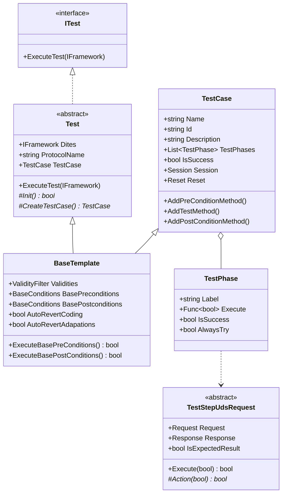
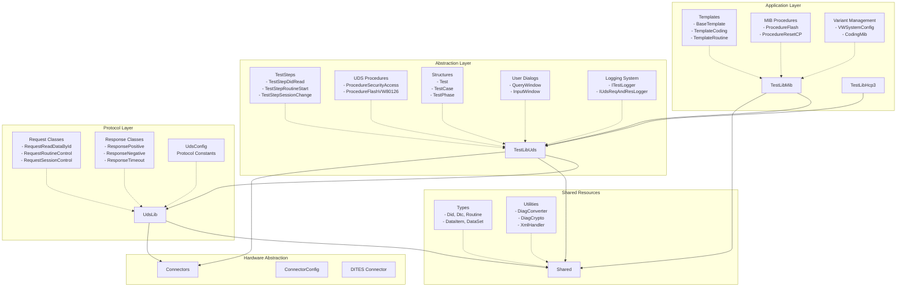
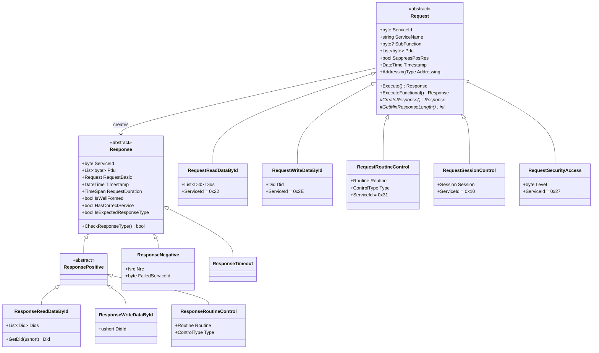
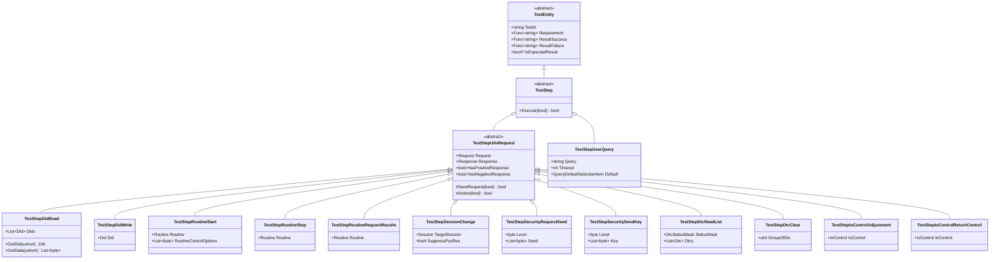
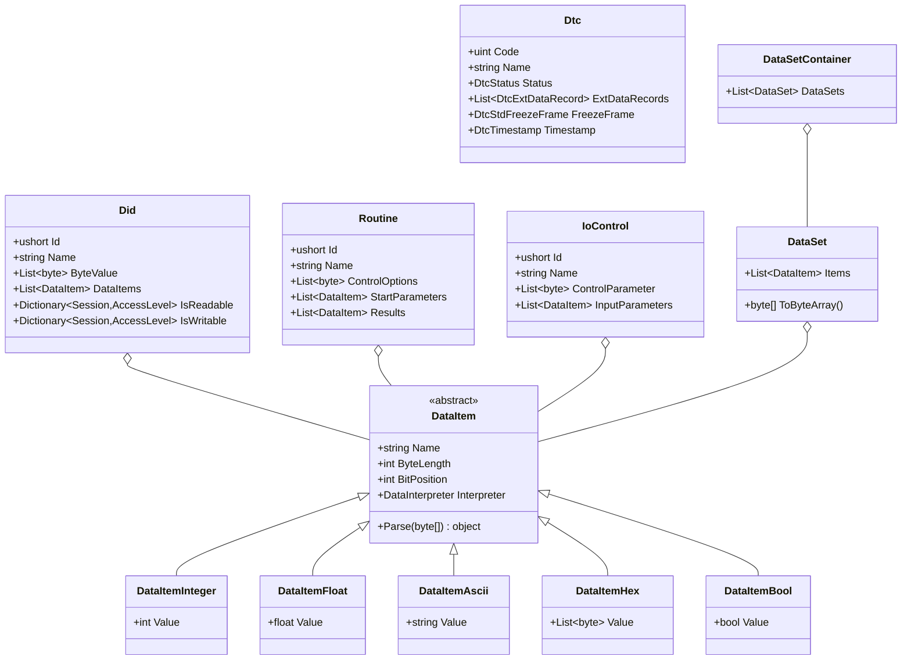
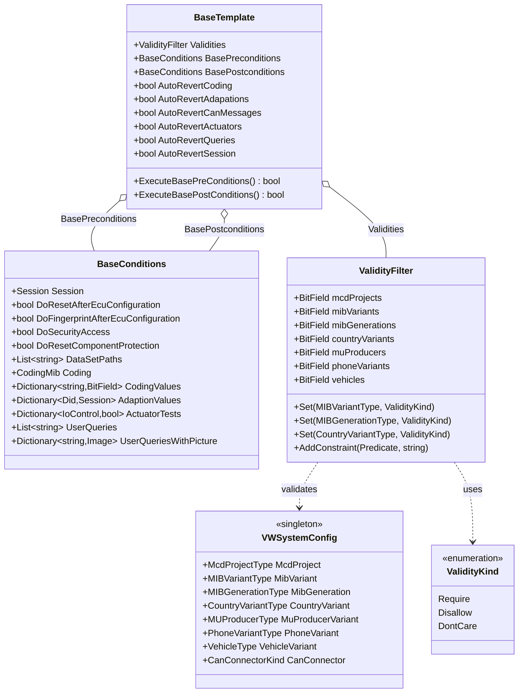
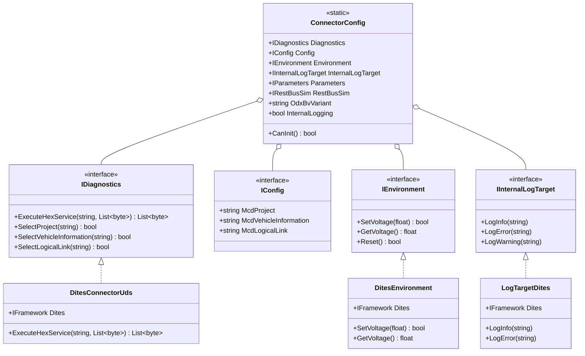
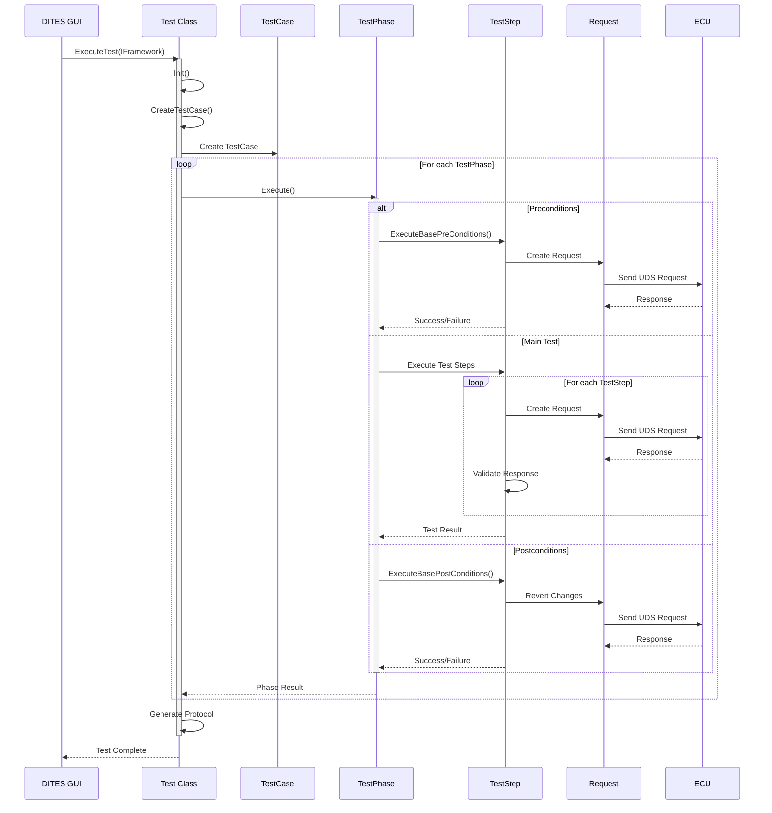
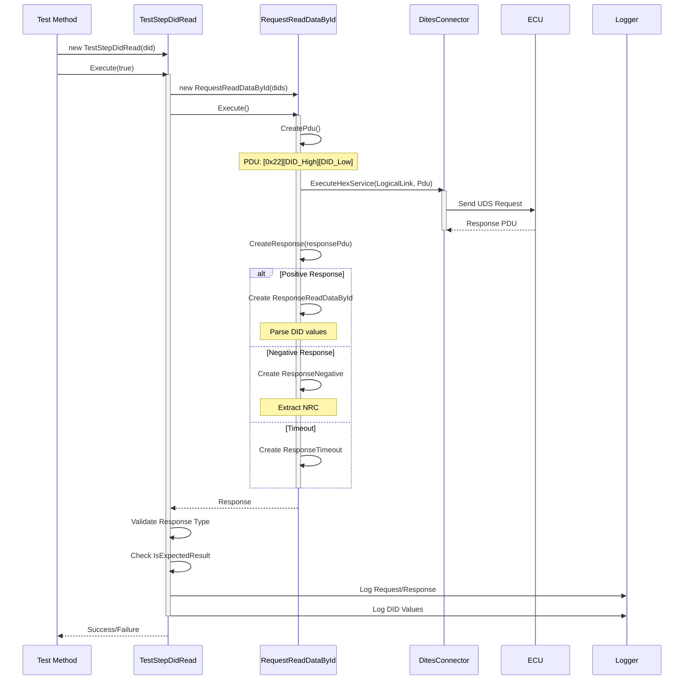

# Diag-Testbase - UDS Diagnose Test Framework

## Überblick

**Diag-Testbase** ist ein C# Test-Automation Framework zur automatisierten Diagnose von **Infotainment-Steuergeräten** (ECUs) mittels **UDS (Unified Diagnostic Services)** Protokoll. Das Framework wird primär für **Volkswagen/Audi MIB (Media Information Bus)** Systeme eingesetzt und ermöglicht die Durchführung standardisierter UDS-Diagnosetests gemäß VW-Spezifikationen.

### Hauptzweck
- Automatisierung von UDS-Protokolltests für Automotive ECUs
- Validierung von Diagnose-Funktionalität in verschiedenen Sessions
- End-of-Line (EOL) Testing und Produktionstests
- Supplier-Testing gemäß VW-Prüfvorschriften

### Entwickelt von
**Expleo Germany GmbH** (ehemals SQS/Prestige) - Automotive Testing Division

---

## Build Status

| Branch | Status |
|--------|--------|
| **Develop** | [](https://dev.azure.com/expleo-diagnostics/Diagnose-SB-TA/_build/latest?definitionId=11&branchName=develop) |
| **Master** | [](https://dev.azure.com/expleo-diagnostics/Diagnose-SB-TA/_build/latest?definitionId=10&branchName=master) |

---

## Technologie-Stack

- **Sprache**: C# (.NET Framework 4.8)
- **Protokoll**: UDS (ISO 14229 - Unified Diagnostic Services)
- **Test-Framework**: DITES (Diagnostic Test Environment Suite)
- **Build-System**: MSBuild / Visual Studio Solution
- **CI/CD**: Azure DevOps Pipelines
- **Package Management**: NuGet

---

## Architektur - 3-Schichten-Modell

Das Framework implementiert eine klare Schichtentrennung für maximale Wiederverwendbarkeit und Wartbarkeit:

```
┌─────────────────────────────────────────────┐
│  TestLibMib / TestLibHcp3 (Application)    │  ← MIB/HCP3-spezifische Tests
│  - Templates für Testfälle                 │
│  - Procedures (Coding, Flash, etc.)        │
│  - Variant Management                       │
└──────────────────┬──────────────────────────┘
                   │ uses
┌──────────────────▼──────────────────────────┐
│  TestLibUds (Abstraction Layer)            │  ← UDS-Protokoll Abstraktion
│  - TestSteps (atomare Operationen)         │
│  - Procedures (komplexe Abläufe)           │
│  - User Dialogs                             │
│  - Logging System                           │
└──────────────────┬──────────────────────────┘
                   │ uses
┌──────────────────▼──────────────────────────┐
│  UdsLib (Protocol Layer)                   │  ← Low-Level UDS
│  - Request/Response Handling               │
│  - Protocol Constants                       │
│  - Message Parsing                          │
└─────────────────────────────────────────────┘
```

### Schicht 1: UdsLib (Protocol Foundation)

**Zweck**: Low-Level UDS-Protokoll Implementation gemäß ISO 14229

**Hauptklassen**:
- `Request` / `Response` - Basis-Klassen für alle UDS-Nachrichten
- `RequestSessionControl` - Session-Wechsel (Default, Extended, EOL, Programming, Development)
- `RequestReadDataById` / `RequestWriteDataById` - DID-basierte Datenzugriffe
- `RequestRoutineControl` - Routine-Steuerung (Start/Stop/RequestResults)
- `RequestSecurityAccess` - Security Access (Seed/Key)
- `ResponseNegative` - Negative Response Codes (NRC)

**Protokoll-Konstanten** (`UdsConfig.cs`):
```csharp
NegativeResponseSid = 0x7F           // Negative Response Service ID
RequestResponseIdDelta = 0x40        // Delta zwischen Request/Response SID
SuppressPosResBit = 0x80            // Bit für "Suppress Positive Response"
MaxMessageLength = 4095              // Max. UDS Message Length
```

**Unterstützte Sessions**:
- `Default (0x01)` - Standard-Session
- `Programming (0x02)` - Flash-/Programmier-Session
- `Extended (0x03)` - Erweiterte Diagnose
- `EOL (0x40)` - End-of-Line Production
- `Development (0x4F)` - Entwicklungs-Session

---

### Schicht 2: TestLibUds (Test Abstraction)

**Zweck**: Abstraktion der UDS-Services in wiederverwendbare Test-Komponenten

#### TestSteps (Atomic Operations)
Atomare Test-Operationen, die einzelne UDS-Services kapseln:

**Kategorien**:
- **Session Management**: `TestStepSessionChange`
- **DID Operations**: `TestStepDidRead`, `TestStepDidWrite`, `TestStepDidCheckValidity`
- **DTC Operations**: `TestStepDtcReadList`, `TestStepDtcClear`, `TestStepDtcCheckStatus`
- **Routine Control**: `TestStepRoutineStart`, `TestStepRoutineStop`, `TestStepRoutineRequestResults`
- **Security Access**: `TestStepSecurityRequestSeed`, `TestStepSecuritySendKey`
- **IO Control**: `TestStepIoControlAdjustment`, `TestStepIoControlReturnControl`
- **Reset Operations**: `TestStepReset`, `TestStepResetByKl`, `TestStepResetManual`
- **Data Transfer**: `TestStepUpload`, `TestStepDownload`, `TestStepTransferDataToEcu`
- **User Interaction**: `TestStepUserQuery`, `TestStepUserInput`, `TestStepUserSelection`
- **CAN Operations**: `TestStepCanSignalSetValue`, `TestStepRestBusSim`
- **Voltage Control**: `TestStepVoltageChange`, `TestStepVoltageGet`

**Beispiel TestStep-Nutzung**:
```csharp
// Session wechseln zu Extended
TestStepSessionChange sessionStep = new TestStepSessionChange(Session.Extended, false);
bool success = sessionStep.Execute(true); // true = positive Response erwartet

// DID lesen
TestStepDidRead readStep = new TestStepDidRead(0xF186, "Active Session");
success &= readStep.Execute(true);
```

#### Procedures (Complex Workflows)
Komplexe Test-Abläufe bestehend aus mehreren TestSteps:

- `ProcedureSecurityAccessUnlock` - Security Access durchführen
- `ProcedureFlashVW80126` - Flash-Prozedur nach VW80126
- `ProcedureDataUpload` / `ProcedureDataDownload` - Daten-Transfer
- `ProcedureCheckDtcData` - DTC-Daten validieren
- `ProcedureValidateDidAccess` - DID-Zugriff in allen Sessions prüfen
- `ProcedureWaitForRoutineCompletion` - Auf Routine-Ende warten

#### Logging System
Mehrschichtiges Logging-System mit verschiedenen Targets:

- `ITestLogger` - Test-Protokollierung (Chapter, Steps, Results)
- `IUdsReqAndResLogger` - Request/Response Logging
- `IDiagTypesLogger` - Diagnose-Datentypen Logging
- `DefaultTestLogger`, `DefaultUdsReqAndResLogger` - Standard-Implementierungen

#### User Dialogs
Interaktive Komponenten für Tester-Interaktion:

- `QueryWindow` - Ja/Nein/Abbrechen Abfragen
- `InputWindow` - Text-Eingaben
- `SelectionWindow` - Auswahl-Listen
- `DidMonitorWindow` - Live-Anzeige von DID-Werten
- `FileOpenDialogWindow` - Datei-Auswahl

---

### Schicht 3: TestLibMib (Application Layer)

**Zweck**: MIB-spezifische Test-Implementierung für Volkswagen Infotainment

#### Templates (Test Case Patterns)
Vordefinierte Test-Templates für häufige Testszenarien:

- `TemplateIdentData` - Identifikationsdaten auslesen
- `TemplateCoding` - Codierung schreiben/validieren
- `TemplateReadWriteDid` - DID Read/Write Tests
- `TemplateRoutineOngoing` - Lang-laufende Routinen
- `TemplateRoutineImmediateEnd` - Kurz-laufende Routinen
- `TemplateRoutineInvalid` - Routine Negativ-Tests
- `TemplateActuator*` - Stellglied-Tests (ongoing/immediate/invalid)
- `TemplateDtcStoringCheck` - DTC-Speicherung prüfen
- `TemplateAdaptionValues` - Adaptionswerte testen
- `TemplateWriteDataSet` - Dataset schreiben
- `TemplateUpload` - Daten-Upload

#### Procedures (MIB-specific)
MIB-spezifische komplexe Abläufe:

- `ProcedureFlash` - MIB Flash-Prozedur
- `ProcedureWriteGen3Dataset` - Gen3 Dataset schreiben
- `ProcedureResetComponentProtection` - Komponentenschutz zurücksetzen
- `ProcedureTesterIdentification` - Tester identifizieren
- `ProcedureSuspendToRam` - Suspend-to-RAM durchführen
- `ProcedureWakeup` - ECU aufwecken
- `ProcedureSleep` - ECU in Sleep versetzen

#### Variant Management
Verwaltung von Fahrzeug-Varianten und Codierungen:

- `VWSystemConfig` - VW System-Konfiguration
- `CodingMib` - MIB Codierungs-Handler
- `VariantInfoHarman` - Harman Hardware-Varianten
- `DatasetRegistry` - Dataset-Verwaltung
- `PrNumberRegistry` - PR-Nummern (Ausstattungscodes)

---

## Shared Library - Gemeinsame Ressourcen

Die **Shared** Library enthält gemeinsam genutzte Komponenten:

### Types (Datenstrukturen)

**Kern-Typen**:
- `Did` - Data Identifier (DID) Definition
- `Dtc` - Diagnostic Trouble Code
- `DataItem` - Einzelnes Datenelement mit Interpretation
- `DataSet` - Sammlung von DataItems
- `Routine` - Routine Definition
- `IoControl` - Input/Output Control Definition
- `FlashODX` - Flash-Datei-Beschreibung

**Data Interpreters**:
- `DataInterpreterInteger` - Integer-Interpretation
- `DataInterpreterFloat` - Float-Interpretation
- `DataInterpreterAscii` - ASCII-String
- `DataInterpreterHex` - Hex-Darstellung
- `DataInterpreterBool` - Boolean
- `DataInterpreterBnc` - Binary Coded

**DTC-spezifisch**:
- `DtcStatus` - DTC Status-Byte
- `DtcExtDataRecord` - Extended Data Records
- `DtcStdFreezeFrame` - Standard Freeze Frame
- `DtcTimestamp` - Zeitstempel

### Utility Functions

**Converter & Encoder**:
- `DiagConverter` - Byte-Array ↔ Datentyp Konvertierung
- `DiagCrypto` - Kryptographie (Security Access)
- `Crc16Ccitt` - CRC16-CCITT Checksummen
- `LZSS` - Lempel-Ziv-Storer-Szymanski Kompression

**Parser & Handler**:
- `XmlHandler` - XML-Parsing für DIDs/DTCs/Routines
- `DidDataParser` - DID-Daten Parsing
- `DiagFilter` - Filter für Diagnose-Daten
- `DiagComparator` - Vergleich von Diagnose-Daten

**Extensions**:
- `CommonExtensions` - C# Extension Methods
- `DiagConverterExtensions` - Diagnose-spezifische Extensions

### Images
Test-relevante Referenz-Bilder für verschiedene Kategorien:
- **Identification**: Labels, Seriennummern, Hardware-Versionen
- **Coding**: UI-Screenshots für Coding-Validierung
- **DTC**: Break-Out-Box Pinnings, Hardware-Setup
- **Common**: Component Protection Screens
- **Production**: Online-Services, Reset-Screens
- **Routine**: Software-Download Screens

---

## Connectors - Hardware-Abstraktion

**Zweck**: Abstraktion der Verbindung zur DITES Test-Umgebung

### Hauptkomponenten

**`ConnectorConfig`** - Zentrale Konfiguration:
```csharp
ConnectorConfig.Ecu            // ECU-Verbindung (UDS)
ConnectorConfig.Logger         // Logging-Target
ConnectorConfig.Environment    // Test-Umgebung
ConnectorConfig.OdxBvVariant   // ODX Base Variant Name
ConnectorConfig.InternalLogging // DITES internes Logging ein/aus
```

**Interfaces**:
- `IInternalLogTarget` - Logging-Schnittstelle
- Implementierungen für DITES-Framework

**User Interface**:
- `ProgressWindow.xaml` - WPF Progress-Anzeige für lang-laufende Operationen
- `InteractiveWait` - Interaktive Wartezeiten mit Abbruch-Möglichkeit

---

## Test-Struktur & Architektur

### Hierarchie der Test-Komponenten

```
Test (ITest)                          ← Haupteinstiegspunkt, DITES Integration
  └── TestCase                        ← Ein kompletter Testfall mit ID
       └── TestPhase[]                ← Preconditions, Main, Postconditions
            └── TestStep[]            ← Atomare Operationen (DID read, etc.)
                 └── Request/Response ← UDS Protocol Messages
```

### Test - Basis-Klasse

Die abstrakte `Test`-Klasse ist der **Haupteinstiegspunkt** und implementiert das DITES `ITest`-Interface:

**Hauptaufgaben**:
- Initialisierung des DITES Frameworks
- Konfiguration der Connectors (ECU, Logger, Environment)
- Ausführung aller TestPhases eines TestCase
- Exception Handling & Logging
- Protokoll-Generierung

**Wichtige Properties**:
```csharp
public static IFramework Dites;          // DITES Framework Referenz
protected string ProtocolName;           // Name des Testprotokolls
protected TestCase TestCase;             // Der auszuführende TestCase
protected bool UseCanOe;                 // CANoe Simulation nutzen?
protected bool UsePowerSupply;           // Spannungsversorgung steuern?
```

**Abstract Methods** (müssen implementiert werden):
```csharp
protected abstract bool Init();                  // Library-Initialisierung
protected abstract TestCase CreateTestCase();    // TestCase erstellen
```

### TestCase - Ein kompletter Test

Ein `TestCase` repräsentiert einen **vollständigen Testfall** mit eindeutiger ID:

**Properties**:
```csharp
public string Name;              // Name des Testfalls
public string Id;                // Test-ID (z.B. DOORS ID)
public string Description;       // Beschreibung
public List<TestPhase> TestPhases; // Liste aller Testphasen
public bool IsSuccess;           // Gesamt-Erfolg
public Session Session;          // Ziel-Session (aus DITES Parameter)
public Reset Reset;              // Reset-Typ (aus DITES Parameter)
```

**Static Features**:
```csharp
// Globale Ergebnis-Sammlung für alle Test-IDs
public static Dictionary<string, bool> TestResults;
```

**Test-Phase Management**:
```csharp
// Convenience-Methoden zum Hinzufügen von Phasen
AddPreConditionMethod(Func<bool?> function, location);
AddTestMethod(Func<bool?> function, location);
AddPostConditionMethod(Func<bool?> function, location);
AddTestIdLoggingMethod();  // Logging-Phase am Ende
```

**TestPhaseLocation Optionen**:
- `StartOfPreConditions` - Ganz am Anfang
- `EndOfPreConditions` - Vor Main Test
- `EndOfMaintest` - Nach Main Test
- `EndOfPostConditions` - Ganz am Ende

### TestPhase - Eine Testphase

Eine `TestPhase` ist ein **logischer Abschnitt** eines Tests:

**Standard-Labels**:
- `"PreCon"` - Vorbedingungen (Setup)
- `"Main"` - Haupttest
- `"PostCon"` - Nachbedingungen (Cleanup)

**Properties**:
```csharp
public string Label;              // Phase-Bezeichner
public Func<bool?> Execute;       // Auszuführende Funktion
public bool? IsSuccess;           // Erfolg dieser Phase
public bool AlwaysTry;           // Auch bei Fehler ausführen?
```

### BaseTemplate - Template-System

`BaseTemplate` ist eine **mächtige Template-Klasse** die von `TestCase` erbt und umfangreiche Pre-/Postcondition-Management bietet:

**Hauptfeatures**:

#### 1. Validity Filter (Plattform-Validierung)
Stellt sicher, dass Tests nur auf passenden Hardware-Varianten laufen:

```csharp
public ValidityFilter Validities;

// Beispiel: Test nur für MIB3 High
tc.Validities.Set(VWSystemConfig.MIBGenerationType.MIB3, ValidityKind.Require);
tc.Validities.Set(VWSystemConfig.MIBVariantType.High, ValidityKind.Require);

// Custom Constraints
tc.Validities.AddConstraint(
    config => config.MibVariant == VWSystemConfig.MIBVariantType.High,
    "Test requires MIB High variant"
);
```

**Unterstützte Filter**:
- McdProject (ODX-Projekt)
- MIB Variant (Entry, Standard, High, Plus)
- MIB Generation (MIB1, MIB2, MIB3)
- Country Variant (EU, NAR, RdW, China, etc.)
- MU Producer (Harman, Continental, Panasonic, etc.)
- Phone Variant (Phone, NoPhone)
- Vehicle Variant (Golf, Passat, Tiguan, etc.)
- Gateway Type

**ValidityKind**:
- `Require` - Variante muss vorhanden sein
- `Disallow` - Variante darf nicht vorhanden sein
- `DontCare` - Egal (default)

#### 2. Base Preconditions
Automatisierte Vorbedingungen:

```csharp
public BaseConditions BasePreconditions;

// Session & Security
BasePreconditions.Session = Session.Eol;
BasePreconditions.DoSecurityAccess = true;

// Dataset schreiben
BasePreconditions.DataSetPaths.Add(@"C:\Datasets\my_dataset.xml");

// Codierung ändern
BasePreconditions.Coding = new CodingMib(...);

// Adaptionen setzen
Did adaption = DataRegistry.Dids.GetDataObject(0x2001);
adaption.ByteValue = new byte[] { 0x01 };
BasePreconditions.AdaptionValues.Add(adaption, Session.Extended);

// Stellglieder aktivieren
IoControl actuator = DataRegistry.IoControls.GetDataObject(0x0101);
BasePreconditions.ActuatorTests.Add(actuator, true); // true = start

// User-Interaktion
BasePreconditions.UserQueries.Add("Bitte USB-Stick einstecken");
BasePreconditions.UserQueriesWithPicture.Add("Prüfe Display", image);

// Reset nach Konfiguration
BasePreconditions.DoResetAfterEcuConfiguration = true;

// Component Protection zurücksetzen (bei CAN Case)
BasePreconditions.DoResetComponentProtection = true;
```

#### 3. Auto-Revert Features
Automatisches Zurücksetzen von Änderungen in Postconditions:

```csharp
public bool AutoRevertCoding = true;        // Codierung zurückschreiben
public bool AutoRevertAdapations = true;    // Adaptionen zurücksetzen
public bool AutoRevertCanMessages = true;   // CAN-Signale zurücksetzen
public bool AutoRevertActuators = true;     // Stellglieder stoppen
public bool AutoRevertQueries = true;       // User-Queries umkehren
public bool AutoRevertSession = true;       // Session zurücksetzen
```

**Wie es funktioniert**:
- Original-Werte werden während Preconditions automatisch ausgelesen
- In `BasePostconditions` gespeichert
- In Postconditions automatisch zurückgeschrieben

#### 4. Base Postconditions
```csharp
public BaseConditions BasePostconditions;

// Wird automatisch befüllt durch Auto-Revert
// Kann aber auch manuell gesetzt werden
BasePostconditions.Session = Session.Default;
BasePostconditions.UserQueries.Add("USB-Stick entfernen");
```

### BaseConditions - Konfigurations-Container

**Properties**:
```csharp
public Session Session;                              // Ziel-Session
public bool DoResetAfterEcuConfiguration;           // Reset nach Config
public bool DoFingerprintAfterEcuConfiguration;     // Fingerprint schreiben
public bool DoSecurityAccess;                       // Security Access
public bool DoResetComponentProtection;             // Komponentenschutz

// Collections
public List<string> DataSetPaths;                   // Dataset XML-Pfade
public CodingMib Coding;                            // Neue Codierung
public Dictionary<string, BitField> CodingValues;   // Codier-Bits
public Dictionary<Did, Session> AdaptionValues;     // Adaptionen
public Dictionary<IoControl, bool> ActuatorTests;   // Stellglieder
public List<string> UserQueries;                    // Text-Queries
public Dictionary<string, Image> UserQueriesWithPicture; // Queries mit Bild
public List<string> UserInfos;                      // Info-Meldungen
public Dictionary<string, Image> UserInfosWithPicture;   // Infos mit Bild
```

---

## TestSteps - Atomare Test-Operationen

TestSteps sind die **kleinsten ausführbaren Einheiten** im Framework und kapseln einzelne UDS-Requests mit vollständiger Validierung.

### Basis-Klasse: TestStepUdsRequest

Alle TestSteps erben von `TestStepUdsRequest`, welche folgende Struktur bereitstellt:

**Properties**:
```csharp
public Request Request;              // Der UDS-Request
public Response Response;            // Die empfangene Response
public Func<string> Requirement;     // Beschreibung der Anforderung
public Func<string> ResultSuccess;   // Success-Nachricht
public Func<string> ResultFailure;   // Failure-Nachricht
public bool? IsExpectedResult;       // Erfolgs-Status
```

**Execution Pattern**:
```csharp
protected abstract bool? Action(bool isSuccessExpected);
public bool Execute(bool isSuccessExpected);
```

### TestStepDidRead - DID lesen

**Zweck**: Liest einen oder mehrere DIDs vom ECU

**Konstruktoren**:
```csharp
// Einzelner DID
TestStepDidRead(Did did);

// Liste von DIDs (Multi-DID Request)
TestStepDidRead(IEnumerable<Did> dids);

// Mit Option zum Deaktivieren der Response-Validierung
TestStepDidRead(Did did, bool doParseMessageBody);
```

**Verwendung**:
```csharp
// DID 0xF186 (Active Session) lesen
Did sessionDid = DataRegistry.Dids.GetDataObject(0xF186);
TestStepDidRead readStep = new TestStepDidRead(sessionDid);
bool success = readStep.Execute(true); // true = positive Response erwartet

// Mehrere DIDs auf einmal lesen
List<Did> dids = new List<Did> {
    DataRegistry.Dids.GetDataObject(0xF186),
    DataRegistry.Dids.GetDataObject(0xF187),
    DataRegistry.Dids.GetDataObject(0xF190)
};
TestStepDidRead multiRead = new TestStepDidRead(dids);
multiRead.Execute(true);

// Gelesene Daten zugreifen
byte[] data = readStep.GetData(0xF186);
Did readDid = readStep.GetDid(0xF186);
```

**Automatisches Logging**:
- Request/Response werden automatisch geloggt
- Gelesene DID-Werte werden interpretiert und angezeigt
- Success/Failure Messages basierend auf Result

### TestStepDidWrite - DID schreiben

**Zweck**: Schreibt Daten zu einem DID

**Konstruktor**:
```csharp
TestStepDidWrite(Did did);  // DID mit bereits gesetzten ByteValue
```

**Verwendung**:
```csharp
// DID 0x0600 (Coding) schreiben
Did coding = DataRegistry.Dids.GetDataObject(0x0600);
coding.ByteValue = new byte[] { 0x17, 0x00, 0x00, 0xFF, 0x01 };

TestStepDidWrite writeStep = new TestStepDidWrite(coding);
bool success = writeStep.Execute(true); // true = positive Response erwartet

// Negativ-Test (Fehler erwartet)
writeStep.Execute(false); // false = negative Response erwartet
```

**Features**:
- Automatisches Logging des zu schreibenden DIDs
- Validierung der Response
- Support für alle DID-Datentypen

### TestStepRoutineStart - Routine starten

**Zweck**: Startet eine ECU-Routine (Service 0x31, Sub 0x01)

**Konstruktoren**:
```csharp
// Mit aktuellen ControlOptions der Routine
TestStepRoutineStart(Routine routine);

// Mit expliziten ControlOptions
TestStepRoutineStart(Routine routine, IEnumerable<byte> controlOptions);
```

**Verwendung**:
```csharp
// Routine ohne Parameter starten
Routine routine = DataRegistry.Routines.GetDataObject(0x0203);
TestStepRoutineStart startRoutine = new TestStepRoutineStart(routine);
startRoutine.Execute(true);

// Routine mit ControlOptions
byte[] options = new byte[] { 0x01, 0x02 };
TestStepRoutineStart startWithOptions = 
    new TestStepRoutineStart(routine, options);
startWithOptions.Execute(true);

// Routine-Ergebnisse abfragen (separater TestStep)
TestStepRoutineRequestResults requestResults = 
    new TestStepRoutineRequestResults(routine);
requestResults.Execute(true);

// Routine stoppen
TestStepRoutineStop stopRoutine = new TestStepRoutineStop(routine);
stopRoutine.Execute(true);
```

**Wichtig**: 
- ControlOptions werden unmittelbar vor Execution gesetzt
- Verhindert Race Conditions bei mehreren TestStep-Instanzen

### Weitere wichtige TestSteps

#### Session Management
```csharp
// Session wechseln
TestStepSessionChange changeSession = 
    new TestStepSessionChange(Session.Extended, false);
changeSession.Execute(true);

// Mit Suppress Positive Response
TestStepSessionChange changeSpr = 
    new TestStepSessionChange(Session.Eol, true);
```

#### Security Access
```csharp
// Seed anfordern
TestStepSecurityRequestSeed requestSeed = 
    new TestStepSecurityRequestSeed(0x03); // Level 3
requestSeed.Execute(true);

// Key senden
TestStepSecuritySendKey sendKey = 
    new TestStepSecuritySendKey(0x04, keyBytes);
sendKey.Execute(true);

// Calculate Key (Crypto)
TestStepSecurityCalculateKey calculateKey = 
    new TestStepSecurityCalculateKey(seedBytes, securityLevel);
byte[] calculatedKey = calculateKey.Key;
```

#### DTC Operations
```csharp
// DTC Liste lesen
TestStepDtcReadList readDtcs = 
    new TestStepDtcReadList(DtcStatusMask.TestFailed);
readDtcs.Execute(true);

// DTC löschen
TestStepDtcClear clearDtcs = new TestStepDtcClear();
clearDtcs.Execute(true);

// DTC Status prüfen
TestStepDtcCheckStatus checkStatus = 
    new TestStepDtcCheckStatus(dtc, expectedStatus);
checkStatus.Execute(true);
```

#### IO Control (Stellglieder)
```csharp
// Stellglied aktivieren
IoControl actuator = DataRegistry.IoControls.GetDataObject(0x0101);
TestStepIoControlAdjustment startActuator = 
    new TestStepIoControlAdjustment(actuator);
startActuator.Execute(true);

// Kontrolle zurückgeben
TestStepIoControlReturnControl stopActuator = 
    new TestStepIoControlReturnControl(actuator);
stopActuator.Execute(true);
```

#### User Interaction
```csharp
// Ja/Nein Abfrage
TestStepUserQuery query = 
    new TestStepUserQuery("USB-Stick einstecken?");
bool userConfirmed = query.Execute(true);

// Mit Timeout und Default
TestStepUserQuery queryTimeout = 
    new TestStepUserQuery("Weiter?", 30000, QueryDefaultSelectionItem.DefaultYes);

// Mit Bild
TestStepUserQueryWithPicture queryPicture = 
    new TestStepUserQueryWithPicture("Prüfe Display", image);
```

---

## Request/Response System - UDS Protocol Layer

### Request - Basis-Klasse

Die abstrakte `Request`-Klasse ist die **Basis aller UDS-Requests**:

**Wichtige Properties**:
```csharp
public abstract byte ServiceId;           // Service ID (z.B. 0x22)
public abstract string ServiceName;       // Name (z.B. "ReadDataById")
public abstract bool HasSubFunction;      // Nutzt Subfunction?
public abstract bool SuppressPosResAllowed; // SPR erlaubt?
public abstract bool FuncAddrAllowed;     // Functional Addr. erlaubt?
public abstract Type ExpectedResponse;    // Erwartete Response-Klasse

public byte? SubFunction;                 // Subfunction (falls vorhanden)
public List<byte> Pdu;                    // Komplette PDU (Protocol Data Unit)
public string PduHex;                     // PDU als Hex-String
public bool SuppressPosRes;              // Suppress Positive Response Bit
public DateTime Timestamp;                // Zeitstempel der Ausführung
public AddressingType Addressing;         // Physical/Functional
```

**Execution Methods**:
```csharp
// Physical Addressing (direkt zum ECU)
Response Execute();

// Functional Addressing (Broadcast)
Response ExecuteFunctional();
```

**PDU Construction**:
```csharp
// PDU wird automatisch erstellt:
// [ServiceId] [SubFunction | SPR-Bit] [MessageBody...]

// Beispiel: ReadDataById 0xF186
// PDU: [0x22] [0xF1] [0x86]
```

**Events** (für Logging/Monitoring):
```csharp
Request.RequestSent += (sender, e) => { /* ... */ };
Request.RequestSentPhysical += (sender, e) => { /* ... */ };
Request.ResponseReceived += (sender, e) => { /* ... */ };
```

### Response - Basis-Klasse

Die abstrakte `Response`-Klasse ist die **Basis aller UDS-Responses**:

**Properties**:
```csharp
public byte ServiceId;                    // Service ID der Response
public List<byte> Pdu;                    // Komplette Response-PDU
public string PduHex;                     // PDU als Hex-String
public Request RequestBasic;              // Zugehöriger Request
public AddressingType Adressing;          // Physical/Functional
public DateTime Timestamp;                // Empfangs-Zeitstempel
public TimeSpan RequestDuration;          // Request bis Response Zeit

// Validierung
public bool IsWellFormed;                 // Formal korrekt?
public bool HasCorrectService;            // Service ID passt?
public bool HasLengthWithinRange;         // Länge OK?
public bool HasAllDataAssigned;           // Alle Bytes zugeordnet?
public bool IsExpectedResponseType;       // Typ wie erwartet?

// Response Pending Support
public List<TimeSpan> ResponsePendingTimings; // NRC 0x78 Timings
```

**Response-Typen**:
```csharp
ResponsePositive      // Positive Antwort (Service-spezifisch)
ResponseNegative      // Negative Response (NRC)
ResponseTimeout       // Keine Antwort empfangen
ResponseGeneric       // Unbekanntes Format
```

**Response Type Checking**:
```csharp
bool? CheckResponseType(bool isNegativeResponseExpected, bool isSentFunctional);

// Automatische Validierung:
// - Physical + SPR=false + Success expected → ResponsePositive
// - Physical + SPR=false + Failure expected → ResponseNegative
// - Physical + SPR=true + Success expected → ResponseTimeout
// - Functional + SPR=true → Special handling (NRC Suppression)
```

**Addressing Types**:
```csharp
enum AddressingType {
    Physical = 0x00,    // Direkt zum ECU (0x07xx)
    Functional = 0x01   // Broadcast (0x07DF oder 0x0700)
}
```

### Spezifische Response-Typen

**ResponsePositive** (Service-spezifische Implementierungen):
```csharp
ResponseReadDataById      // 0x62 + DIDs
ResponseWriteDataById     // 0x6E
ResponseRoutineControl    // 0x71
ResponseSessionControl    // 0x50
ResponseSecurityAccess    // 0x67
// ... etc
```

**ResponseNegative**:
```csharp
public Nrc Nrc;           // Negative Response Code
public byte ServiceId;     // Failed Service ID

// Häufige NRCs:
// 0x11 - ServiceNotSupported
// 0x12 - SubFunctionNotSupported
// 0x13 - IncorrectMessageLength
// 0x22 - ConditionsNotCorrect
// 0x31 - RequestOutOfRange
// 0x33 - SecurityAccessDenied
// 0x35 - InvalidKey
// 0x78 - RequestCorrectlyReceived-ResponsePending
```

### Connector Architecture

Die **Connectors** abstrahieren die Verbindung zur Hardware:

```csharp
// Zentrale Konfiguration
ConnectorConfig.Diagnostics    // IDiagnostics - ODX/UDS Communication
ConnectorConfig.Config         // IConfig - DITES Config (Project, LL, etc.)
ConnectorConfig.Environment    // IEnvironment - Voltage, Reset, etc.
ConnectorConfig.InternalLogTarget // IInternalLogTarget - Logging
ConnectorConfig.Parameters     // IParameters - Test Parameters
ConnectorConfig.RestBusSim     // IRestBusSim - CAN Simulation
```

---

## Config System - MIB Configuration

Die `Config`-Klasse enthält **alle MIB-spezifischen Konfigurationen**:

### Zentrale Parameter

```csharp
// Security & Timing
public static ulong SecurityNr = 20103;      // Security Access Level
public static uint WaitForReboot = 20000;    // Wartezeit nach Reset (ms)
public static string ManualResetKeys;        // "Menu + Wählrad + NO"

// Logging
public static LogOptionsReqAndRes ReqAndResLogOptions;
public static LogOptionsDiagTypes DataTypesLogOption;
```

### XML-Schema Pfade

```csharp
public static string DidSchemaPath;          // DidSchema.xsd
public static string DtcSchemaPath;          // DtcSchema.xsd
public static string RoutineSchemaPath;      // RoutineSchema.xsd
public static string IoControlSchemaPath;    // IoControlSchema.xsd
public static string DatasetSchemaPath;      // DatasetSchema.xsd
public static string CanSignalSchemaPath;    // CanSignalSchema.xsd
```

### XML-Daten Listen

```csharp
public static List<string> DidListPaths;         // DID Definitionen
public static List<string> DtcListPaths;         // DTC Definitionen
public static List<string> RoutineListPaths;     // Routine Definitionen
public static List<string> IoControlListPaths;   // IoControl Definitionen
public static List<string> DatasetListMIB1Paths; // MIB1 Datasets
public static List<string> DatasetListMIB2Paths; // MIB2 Datasets
public static List<string> CanSignalListPaths;   // CAN Signal Definitionen
```

### Externe Daten-Pfade

```csharp
public static string CanOePath;          // CANoe Konfiguration
public static string SwapFecPath;        // SWAP FEC Dateien
public static string ZdcPath;            // ZDC Dateien
public static string VirtualVehiclePath; // PR-Nummern Konfigurationen
public static string SfdTokenPath;       // SFD Token
public static string IvdHashPath;        // IVD Configuration Hashes
```

### Configuration Loading

```csharp
// ConfigMib.xml laden
Config.ReadFromFile(@"C:\Tests\ConfigMib.xml");
```

**Beispiel ConfigMib.xml Struktur**:
```xml
<Config>
  <SecurityNr>20103</SecurityNr>
  <ManualResetKeys>Menu + Wählrad + NO</ManualResetKeys>
  <LogOptionsDiagTypes>Detailed</LogOptionsDiagTypes>
  <LogOptionsRequestAndResponse>Compact</LogOptionsRequestAndResponse>
  
  <CanOeConfig>CANoe\MIB_Config.cfg</CanOeConfig>
  
  <DidSchema>XML\DidSchema.xsd</DidSchema>
  <DidList>XML\DidList_VW80124.xml</DidList>
  <DidList>XML\DidList_VW80125.xml</DidList>
  
  <DtcSchema>XML\DtcSchema.xsd</DtcSchema>
  <DtcList>XML\DtcList_HUD.xml</DtcList>
  
  <SwapFecPath>SwapFecs\</SwapFecPath>
  <ZdcPath>Zdcs\</ZdcPath>
</Config>
```

---

## Data Registry System

Das Framework nutzt **Registry-Pattern** für zentrale Datenverwaltung:

```csharp
// DIDs zugreifen
Did sessionDid = DataRegistry.Dids.GetDataObject(0xF186);

// DTCs zugreifen
Dtc dtc = DataRegistry.Dtcs.GetDataObject(0x123456);

// Routines zugreifen
Routine routine = DataRegistry.Routines.GetDataObject(0x0203);

// IoControls zugreifen
IoControl actuator = DataRegistry.IoControls.GetDataObject(0x0101);

// Parameter zugreifen
Parameter param = ParameterHandler.GetParameter("TestMode");
```

---

## Beispiele

### Beispiel 1: Einfacher Test ohne Template

```csharp
public class SimpleTest : Test
{
    protected override bool Init()
    {
        // Connectors konfigurieren
        ConnectorConfig.Ecu = new DitesConnectorUds(Dites);
        ConnectorConfig.InternalLogTarget = new LogTargetDites(Dites);
        ConnectorConfig.Environment = new DitesEnvironment(Dites);
        ConnectorConfig.OdxBvVariant = "BV_MainUnit";
        
        Logger.InitByDefault(ConnectorConfig.InternalLogTarget);
        Config.ReadFromFile(@"C:\Tests\ConfigMib.xml");
        
        return true;
    }

    protected override TestCase CreateTestCase()
    {
        TestCase tc = new TestCase();
        tc.Name = "Simple DID Read Test";
        tc.Id = "TC_001";
        tc.Description = "Liest Active Session DID";
        
        tc.AddTestMethod(ExecuteTest);
        tc.AddTestIdLoggingMethod();
        
        return tc;
    }
    
    private bool? ExecuteTest()
    {
        bool success = true;
        
        // Session wechseln
        TestStepSessionChange sessionStep = 
            new TestStepSessionChange(Session.Extended, false);
        success &= sessionStep.Execute(true);
        
        // DID lesen
        Did sessionDid = DataRegistry.Dids.GetDataObject(0xF186);
        TestStepDidRead readStep = new TestStepDidRead(sessionDid);
        success &= readStep.Execute(true);
        
        // Zurück zu Default
        TestStepSessionChange defaultStep = 
            new TestStepSessionChange(Session.Default, false);
        success &= defaultStep.Execute(true);
        
        return success;
    }
}
```

### Beispiel 2: Test Case mit SG-Ident

```csharp
public class TestCaseReadSgIdent
{
    public UInt16 IdentNr { get; set; }
    public string IdentName { get; set; }
    public Session DiagSession { get; set; }
    public bool IdentIsReadable { get; set; }

    public TestCaseReadSgIdent(
        UInt16 idNumber, string idName, Session session, bool isReadable)
    {
        this.DiagSession = session;
        this.IdentNr = idNumber;
        this.IdentName = idName;
        this.IdentIsReadable = isReadable;
    }

    public bool Execute()
    {
        // Test-Header loggen
        Logger.LogChapter("Test", $"SG Ident {IdentNr:X} ({IdentName}) auslesen");

        bool success = true;

        // 1. Session wechseln
        TestStepSessionChange sessionStep = 
            new TestStepSessionChange(DiagSession, false);
        success &= sessionStep.Execute(true);

        // 2. SG-Ident lesen
        TestStepIdRead readStep = new TestStepIdRead(IdentNr, IdentName);
        success &= readStep.Execute(IdentIsReadable);

        // 3. Zurück zu Default Session
        TestStepSessionChange defaultSession = 
            new TestStepSessionChange(Session.Default, false);
        success &= defaultSession.Execute(true);

        // Test-Ende loggen
        Logger.LogParagraphEnd("Test", 
            "Lesbarkeit wie erwartet", 
            "Lesbarkeit nicht wie erwartet", 
            success);

        return success;
    }
}
```

### Beispiel 3: Test Case Codierung schreiben

```csharp
public class TestCaseWriteCoding
{
    public Session DiagSession { get; set; }
    public UInt16 IdentCoding { get; set; }
    public byte[] CodingValue { get; set; }
    public byte[] FingerprintValue { get; set; }

    public TestCaseWriteCoding(byte[] coding, Session session, bool isWritable)
    {
        this.DiagSession = session;
        this.IdentCoding = 0x0600;
        this.CodingValue = coding;
        this.FingerprintValue = GetDefaultFingerprint();
    }

    public bool Execute()
    {
        bool success = true;

        // 1. Session wechseln (EOL für Coding)
        TestStepSessionChange sessionStep = 
            new TestStepSessionChange(DiagSession, false);
        success &= sessionStep.Execute(true);

        // 2. Fingerprint schreiben (für Coding-Schutz)
        TestStepFingerprintWrite fpWrite = 
            new TestStepFingerprintWrite(0xF15A, "Fingerprint", FingerprintValue);
        success &= fpWrite.Execute(true);

        // 3. Codierung schreiben
        TestStepCodingWrite codingWrite = 
            new TestStepCodingWrite(IdentCoding, "Coding", CodingValue);
        success &= codingWrite.Execute(true);

        // 4. Zurück zu Default
        TestStepSessionChange defaultSession = 
            new TestStepSessionChange(Session.Default, false);
        success &= defaultSession.Execute(true);

        return success;
    }
}
```

### Beispiel 4: Komplexer Test mit BaseTemplate

```csharp
public class ComplexMibTest : Test
{
    protected override bool Init()
    {
        // Connectors konfigurieren
        ConnectorConfig.Ecu = new DitesConnectorUds(Dites);
        ConnectorConfig.InternalLogTarget = new LogTargetDites(Dites);
        ConnectorConfig.Environment = new DitesEnvironment(Dites);
        ConnectorConfig.OdxBvVariant = "BV_MainUnit";
        
        Logger.InitByDefault(ConnectorConfig.InternalLogTarget);
        Config.ReadFromFile(@"C:\Tests\ConfigMib.xml");
        
        return true;
    }

    protected override TestCase CreateTestCase()
    {
        // Template erstellen
        BaseTemplate tc = new BaseTemplate();
        tc.Name = "Coding Test mit Validierung";
        tc.Id = "TC_12345";
        tc.Description = "Testet Codierung in verschiedenen Varianten";
        
        // Validität festlegen
        tc.Validities.Set(VWSystemConfig.MIBGenerationType.MIB3, 
            ValidityKind.Require);
        tc.Validities.Set(VWSystemConfig.MIBVariantType.High, 
            ValidityKind.Require);
        
        // Preconditions
        tc.BasePreconditions.Session = Session.Eol;
        tc.BasePreconditions.DoSecurityAccess = true;
        tc.BasePreconditions.DoResetAfterEcuConfiguration = true;
        
        // Coding vorbereiten
        Did coding = DataRegistry.Dids.GetDataObject(0x0600);
        coding.ByteValue = new byte[] { 0x17, 0x00, 0x00, 0xFF, 0x01 };
        tc.BasePreconditions.Coding = new CodingMib(coding);
        
        // User-Interaktion
        tc.BasePreconditions.UserQueries.Add("Prüfe Display-Anzeige vor Test");
        
        // Auto-Revert aktivieren
        tc.AutoRevertCoding = true;
        tc.AutoRevertSession = true;
        
        // Testphasen hinzufügen
        tc.AddPreConditionMethod(tc.ExecuteBasePreConditions);
        tc.AddTestMethod(ExecuteMainTest);
        tc.AddPostConditionMethod(tc.ExecuteBasePostConditions);
        tc.AddTestIdLoggingMethod();
        
        return tc;
    }
    
    private bool? ExecuteMainTest()
    {
        bool success = true;
        
        // Coding validieren
        Did coding = DataRegistry.Dids.GetDataObject(0x0600);
        TestStepDidRead readCoding = new TestStepDidRead(coding);
        success &= readCoding.Execute(true);
        
        if (success)
        {
            // Prüfe dass Coding korrekt geschrieben wurde
            success &= coding.ByteValue[0] == 0x17;
        }
        
        return success;
    }
}
```

---

## UDS Services - Vollständige Unterstützung

### Service 0x10 - Diagnostic Session Control
- Default Session (0x01)
- Programming Session (0x02)
- Extended Session (0x03)
- EOL Session (0x40)
- Development Session (0x4F)

### Service 0x11 - ECU Reset
- Hard Reset (0x01)
- Key Off/On (0x02)
- Soft Reset (0x03)

### Service 0x14 - Clear Diagnostic Information
- DTC löschen nach Gruppen

### Service 0x19 - Read DTC Information
- Report Number of DTC by Status Mask
- Report DTC by Status Mask
- Report DTC Snapshot Record
- Report DTC Extended Data Record
- Report Most Recent DTC

### Service 0x22 - Read Data By Identifier
- Beliebige DIDs lesen
- Multi-DID Requests

### Service 0x27 - Security Access
- Request Seed (0x01, 0x03, 0x05, ...)
- Send Key (0x02, 0x04, 0x06, ...)
- Seed/Key Algorithmen

### Service 0x28 - Communication Control
- Enable/Disable RX/TX
- Network-spezifische Kontrolle

### Service 0x2E - Write Data By Identifier
- DIDs schreiben
- Codierung schreiben
- Fingerprint schreiben

### Service 0x2F - Input Output Control By Identifier
- Stellglieder aktivieren
- Return Control to ECU

### Service 0x31 - Routine Control
- Start Routine (0x01)
- Stop Routine (0x02)
- Request Routine Results (0x03)
- VW-spezifische Routinen

### Service 0x34 - Request Download
- Flash-Vorbereitung

### Service 0x35 - Request Upload
- Daten vom ECU lesen

### Service 0x36 - Transfer Data
- Block-weise Daten übertragen

### Service 0x37 - Request Transfer Exit
- Transfer beenden

### Service 0x3E - Tester Present
- Keep-Alive für Sessions
- Auto Tester Present

### Service 0x85 - Control DTC Setting
- DTC Storage ein/aus

### Service 0x86 - Response On Event
- Event-basierte Responses

---

## Logical Links - ECU Adressen

Das Framework unterstützt folgende ECU-Adressen:

| Adresse | ECU | Beschreibung |
|---------|-----|--------------|
| 0x0000 | AllUdsSystems | Alle UDS-Systeme (Functional) |
| 0x0005 | FBS_BCM2 | Body Control Module 2 |
| 0x0007 | MMI_HU | MMI Head Unit |
| 0x0008 | Klima | Klimasteuerung |
| 0x000E | Mediaplayer1 | Media Player 1 |
| 0x0013 | ACC | Active Cruise Control |
| 0x0015 | Airbag | Airbag Steuergerät |
| 0x0017 | Kombi | Kombiinstrument |
| 0x0019 | Gateway | CAN Gateway |
| 0x005F | MainUnit | Haupteinheit (MIB) |

---

## Negative Response Codes (NRC)

Häufige NRCs die vom Framework behandelt werden:

- `0x11` - Service Not Supported
- `0x12` - Sub-Function Not Supported
- `0x13` - Incorrect Message Length
- `0x22` - Conditions Not Correct
- `0x24` - Request Sequence Error
- `0x31` - Request Out Of Range
- `0x33` - Security Access Denied
- `0x35` - Invalid Key
- `0x36` - Exceed Number Of Attempts
- `0x37` - Required Time Delay Not Expired
- `0x72` - General Programming Failure
- `0x78` - Request Correctly Received - Response Pending

---

## XML-basierte Konfiguration

Das Framework verwendet XML-Dateien zur Definition von:

### DID Definitions (`DidSchema.xsd`)
```xml
<Did id="0xF186" name="Active Session">
  <DataItem name="Session" type="Integer" length="1"/>
</Did>
```

### DTC Definitions (`DtcSchema.xsd`)
```xml
<Dtc code="0x123456" name="CAN Timeout">
  <ExtDataRecord>...</ExtDataRecord>
</Dtc>
```

### Routine Definitions (`RoutineSchema.xsd`)
```xml
<Routine id="0x0203" name="Calculate Checksum">
  <StartParameters>...</StartParameters>
</Routine>
```

### Flash ODX (`FlashODXSchema.xsd`)
Flash-Datei Beschreibungen

---

## Build & Deployment

### Dependencies
- **DITES Framework** (via NuGet) - Hauptabhängigkeit
- .NET Framework 4.8
- Standard C# Libraries

### Build Pipeline (Azure DevOps)
- `diagtb-build-develop.yml` - Development Branch
- `diagtb-build-master.yml` - Release Branch
- `diagtb-steps-template.yml` - Wiederverwendbare Steps
- `diagtb-env-variable-template.yml` - Environment Variables

### NuGet Package
Das Framework wird als NuGet Package bereitgestellt:
- Package: `DiagTestbase.nuspec`
- Artifact: DLL-Assemblies

---

## Wichtige Hinweise

### Security Access
- Seed/Key Algorithmen sind ECU-spezifisch
- Implementierung in `DiagCrypto`
- Verschiedene Access-Levels (0x01-0x7F)

### Tester Present
- Automatisch in Extended/EOL Sessions
- Intervall: 2000ms (typ.)
- Suppress Positive Response

### Session Management
- Sessions haben Timeout (5s Standard)
- Default Session nach Reset
- Extended/EOL nur mit Security Access

### Flash-Prozeduren
- Nach VW80126 Standard
- Fingerprint vor/nach Flash
- Checksum-Validierung

---

## Verwendung & Integration

### Voraussetzungen
1. **DITES Framework** installiert
2. **ODX-Projektdateien** für Ziel-ECU
3. **Hardware-Verbindung** (CAN, DoIP, etc.)
4. **ConfigMib.xml** mit Pfaden zu XML-Listen
5. **XML-Listen** für DIDs, DTCs, Routines, etc.

### Typischer Workflow
1. DITES Framework initialisieren
2. ODX-Projekt auswählen
3. Logical Link auswählen (ECU-Adresse)
4. Connectors konfigurieren
5. Config.xml laden
6. Data Registries initialisieren
7. Test Cases ausführen
8. Protokoll generieren

### Test-Erstellung mit BaseTemplate
1. Von `BaseTemplate` erben
2. Validity Filter konfigurieren (MIB-Varianten)
3. BasePreconditions definieren (Session, Coding, etc.)
4. Main Test implementieren
5. Auto-Revert aktivieren
6. TestPhases hinzufügen

---

## UML-Diagramme

### Gesamtarchitektur - Klassendiagramm



### 3-Schichten Architektur



### Request/Response Hierarchie



### TestStep Hierarchie



### Shared Types - Data Model



### BaseTemplate System - Detailliert



### Connector Architecture



### Sequenzdiagramm - TestCase Execution



### Sequenzdiagramm - DID Read mit Validierung



### Datenfluss - Preconditions mit Auto-Revert

```mermaid
flowchart TD
    Start([Test Start]) --> ValidCheck{Validity<br/>Check}
    ValidCheck -->|Not Valid| UserQuery1[User Query:<br/>Continue anyway?]
    UserQuery1 -->|No| End([Test Aborted])
    UserQuery1 -->|Yes| SaveSession
    ValidCheck -->|Valid| SaveSession
    
    SaveSession[Save Current Session<br/>if AutoRevertSession] --> ChangeSession[Change to EOL Session]
    ChangeSession --> WriteFingerprint[Write Fingerprint]
    
    WriteFingerprint --> Dataset{Dataset<br/>configured?}
    Dataset -->|Yes| WriteDataset[Write Dataset]
    Dataset -->|No| CheckCoding
    WriteDataset --> CheckCoding
    
    CheckCoding{Coding<br/>configured?}
    CheckCoding -->|Yes| ReadOrigCoding[Read Original Coding]
    ReadOrigCoding --> SaveCoding[Save to<br/>BasePostconditions]
    SaveCoding --> WriteCoding[Write New Coding]
    WriteCoding --> CheckAdaption
    CheckCoding -->|No| CheckAdaption
    
    CheckAdaption{Adaptions<br/>configured?}
    CheckAdaption -->|Yes| ReadOrigAdaption[Read Original Adaptions]
    ReadOrigAdaption --> SaveAdaption[Save to<br/>BasePostconditions]
    SaveAdaption --> WriteAdaption[Write New Adaptions]
    WriteAdaption --> CheckReset
    CheckAdaption -->|No| CheckReset
    
    CheckReset{Reset After<br/>Config?}
    CheckReset -->|Yes| Reset[Perform Reset]
    Reset --> TargetSession
    CheckReset -->|No| TargetSession
    
    TargetSession[Change to Target Session] --> SecAccess{Security<br/>Access?}
    SecAccess -->|Yes| DoSecAccess[Perform Security Access]
    DoSecAccess --> Actuators
    SecAccess -->|No| Actuators
    
    Actuators{Actuators<br/>configured?}
    Actuators -->|Yes| SaveActuators[Save Stop Commands<br/>to BasePostconditions]
    SaveActuators --> StartActuators[Start/Stop Actuators]
    StartActuators --> UserQueries
    Actuators -->|No| UserQueries
    
    UserQueries{User Queries<br/>configured?}
    UserQueries -->|Yes| CreateRevertQuery[Create Revert Queries<br/>for Postconditions]
    CreateRevertQuery --> ShowQueries[Show User Queries]
    ShowQueries --> MainTest
    UserQueries -->|No| MainTest
    
    MainTest([Execute Main Test])
    
    style SaveCoding fill:#e1f5ff
    style SaveAdaption fill:#e1f5ff
    style SaveActuators fill:#e1f5ff
    style CreateRevertQuery fill:#e1f5ff
```



---

*UML-Diagramme erstellt mit Mermaid. Können in allen Markdown-Viewern mit Mermaid-Support (GitHub, GitLab, VS Code, etc.) angezeigt werden.*